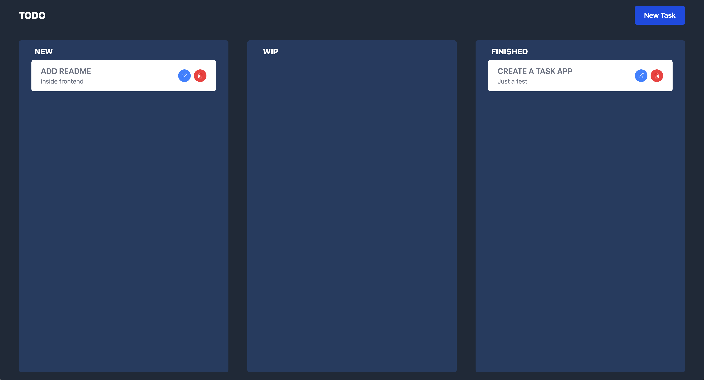
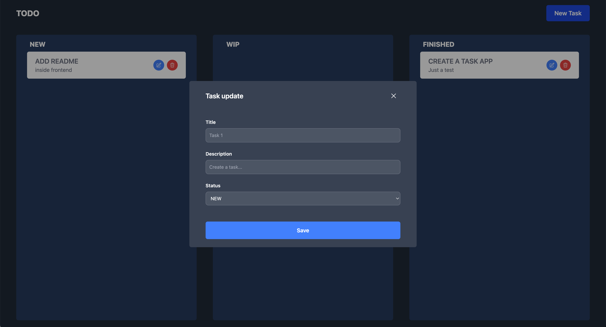

# ✅ TODO App — Fullstack Project

This project is a complete **Todo app** including:

- 🖼️ Frontend: Vue 3 + TypeScript + Tailwind CSS
- 🔧 Backend: NestJS (REST API) + MongoDB

---

## 📦 Requirements

- **Node.js** ≥ 22.x
- **npm** or **pnpm**
- Optionally: [Docker](https://www.docker.com/) + Docker Compose

---

## 📁 Project Structure

```
.
├── api/          # NestJS backend
├── frontend/     # Vue 3 frontend
```

---

## 🚀 Getting Started

Each part of the app has its own README for setup & usage:

- [`/api/`](./api/README.md) — NestJS backend
- [`/frontend/`](./frontend/README.md) — Vue 3 frontend


Then access:

- Frontend: [http://localhost:5173](http://localhost:5173)
- Backend API: [http://localhost:3000](http://localhost:3000)

---

## 📸 Screenshots

### ✅ Todo List (Dark Mode)


### 📝 Task Form



---

## 📚 Technologies

| Layer     | Tech Stack                             |
|-----------|----------------------------------------|
| Frontend  | Vue 3, TypeScript, Vite, Tailwind CSS  |
| Backend   | NestJS, TypeScript, MongoDB            |
| DevOps    | Docker, Docker Compose                 |

---

## 🛠️ Environment Variables

You can define frontend variables in `frontend/.env` (must start with `VITE_`) and backend ones in `api/.env`.

Example:

```env
VITE_API_URL=http://localhost:3000
```

---

## ✨ Author

Built with ❤️ by Sabri Ouaked
